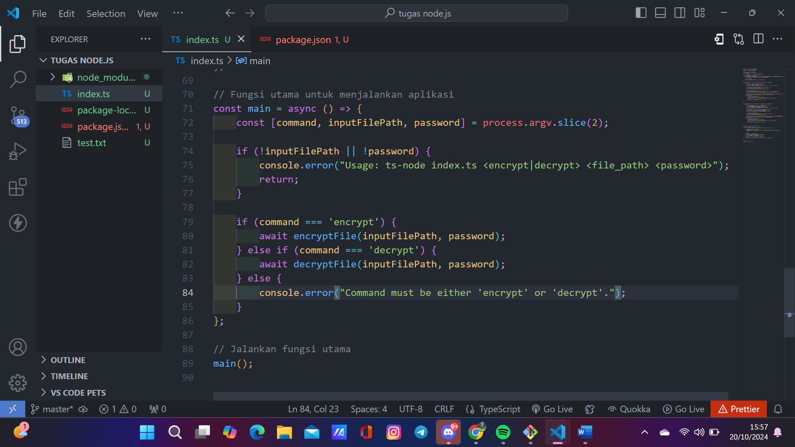
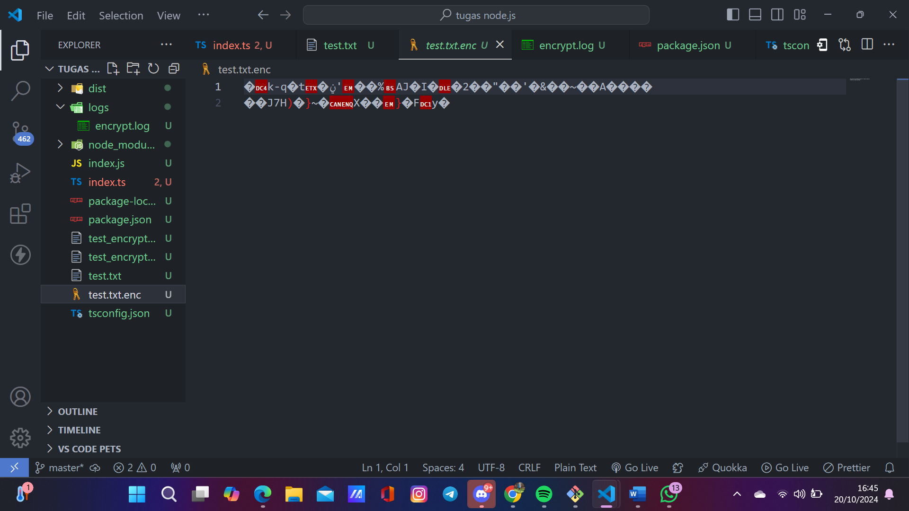
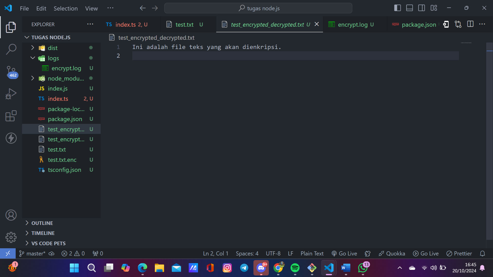
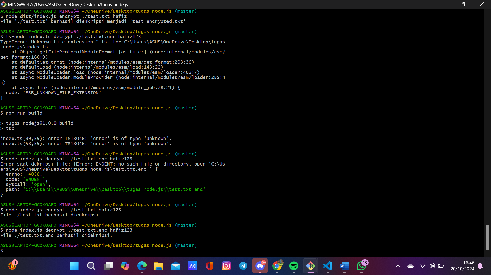
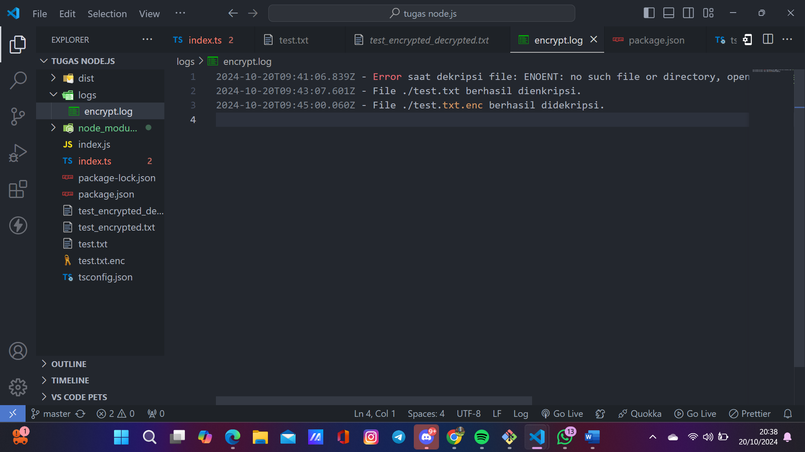

1. Jalankan perintah berikut untuk mengompilasi TypeScript menjadi JavaScript:
di terminal: (npm run build)

2. Menjalankan File JavaScript: Setelah kompilasi, jalankan perintah berikut (gantilah dist/index.js dengan lokasi file JavaScript yang dihasilkan jika berbeda):
(node dist/index.js encrypt ./test.txt hafiz123)

3. Menjalankan Dekripsi
Jika kamu ingin mendekripsi file yang telah dienkripsi, gunakan perintah yang sama tetapi dengan tindakan decrypt:
(ts-node index.ts decrypt ./test.txt.enc hafiz123)

